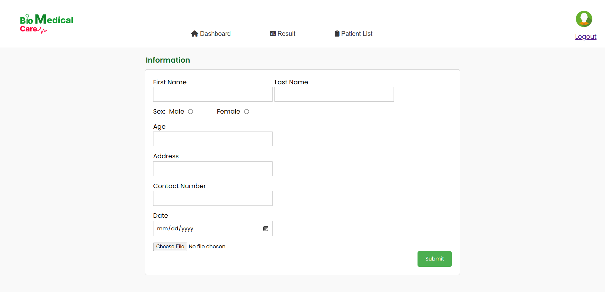
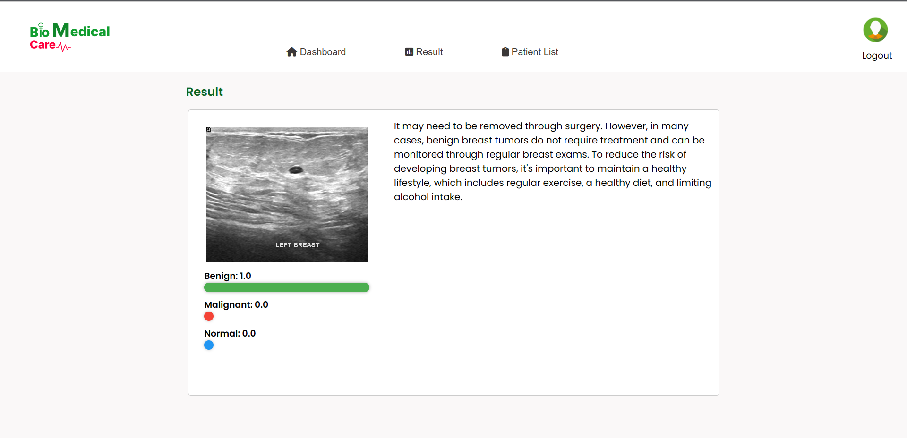
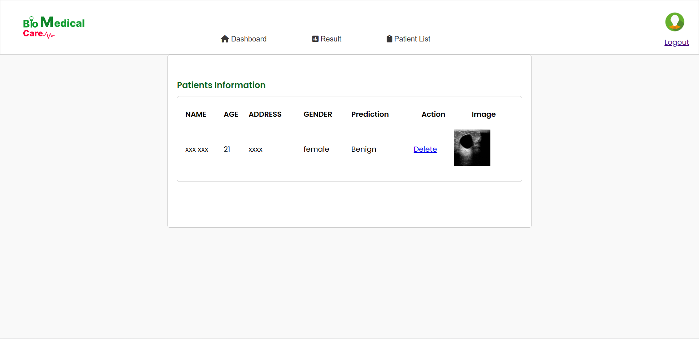

# Breast-Cancer-Detection-using-CNN
This system detects breast cancer using ultrasound images. Performance of three different architectures of CNN are compared.

This is the BioMedical Care (Breast Cancer Detection System)

**Login Page**

**Dashboard**

**Result Page**

**Patient List Page**

